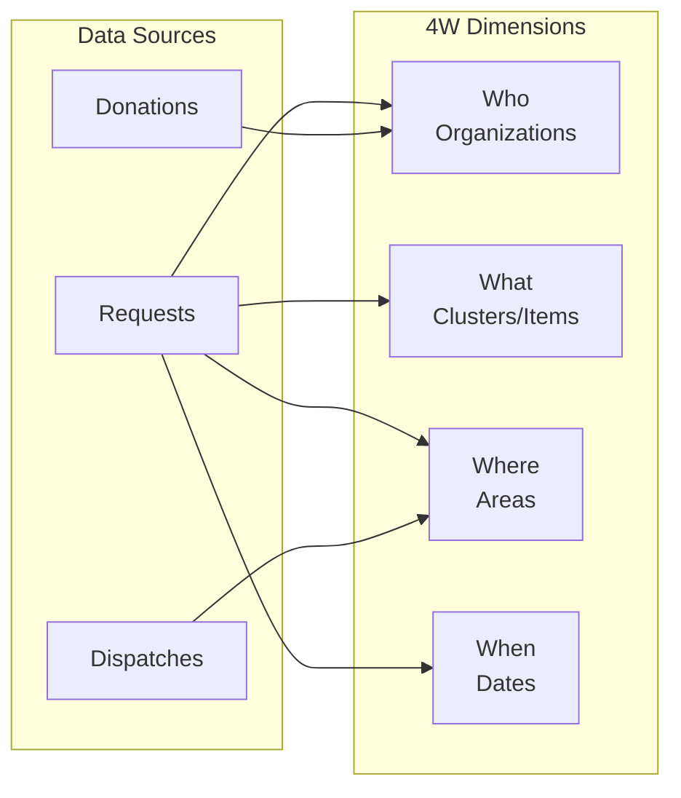
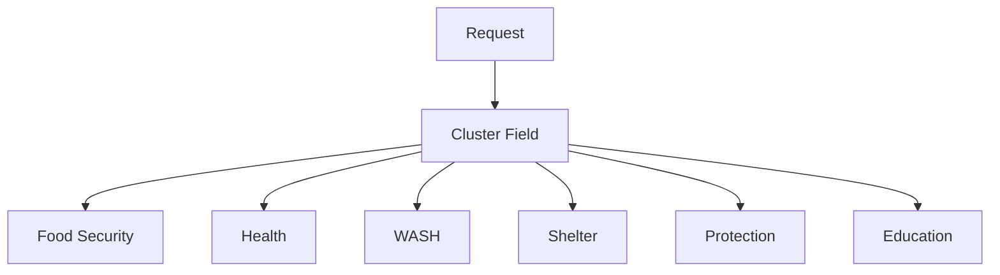

# DRIMS 4W Reporting

The 4W Report is a standard humanitarian coordination tool that answers four key questions about relief operations:
**Who** is doing **What**, **Where**, and **When**.

## Overview



## 4W Dimensions in DRIMS

| Dimension | Field                                    | Description                                        |
| --------- | ---------------------------------------- | -------------------------------------------------- |
| **Who**   | `requester_id` / `cluster_id.partner_id` | Organization requesting or providing assistance    |
| **What**  | `cluster_id` / product categories        | Type of assistance (OCHA cluster or item category) |
| **Where** | `destination_area_id`                    | Geographic location of distribution                |
| **When**  | `date_requested` / `date_needed`         | Time period of the operation                       |

## Accessing the 4W Report

### Via Menu

**DRIMS > Reports > 4W Report**

### Via Wizard

The 4W Report Wizard allows filtering before generating the report:

1. Select **Incident** (required)
2. Set **Date Range** (optional)
3. Filter by **Clusters/Sectors** (optional)
4. Filter by **Area** (optional)
5. Choose status filters:
   - Include Planned/Pending
   - Include Completed
6. Click **Generate Report**

## Report Output

The wizard generates a pivot view with:

### Default Grouping

- **Rows**: Destination Area (Where)
- **Columns**: Requester (Who)
- **Measures**: Total items, Total value

### Available Views

| View  | Purpose                               |
| ----- | ------------------------------------- |
| Pivot | Tabular cross-reference of dimensions |
| Graph | Visual charts for presentations       |

## Wizard Model

**Model**: `spp.drims.report.4w.wizard`

### Fields

| Field               | Type      | Description                                |
| ------------------- | --------- | ------------------------------------------ |
| `incident_id`       | Many2one  | Required - Filter by incident              |
| `date_from`         | Date      | Start of date range                        |
| `date_to`           | Date      | End of date range                          |
| `cluster_ids`       | Many2many | Filter by humanitarian clusters            |
| `area_id`           | Many2one  | Filter by geographic area (uses hierarchy) |
| `include_planned`   | Boolean   | Include draft/pending/approved requests    |
| `include_completed` | Boolean   | Include dispatched/delivered requests      |

## Integration with OCHA Clusters

Each request can be tagged with an OCHA/IASC humanitarian cluster:



See [COORDINATION.md](COORDINATION.md) for the full list of OCHA clusters.

## Example Use Cases

### Cluster Coordination Meeting

Generate report showing:

- All requests grouped by cluster
- Filter to specific incident
- Include both planned and completed

```python
wizard = env['spp.drims.report.4w.wizard'].create({
    'incident_id': incident.id,
    'include_planned': True,
    'include_completed': True,
})
action = wizard.generate_report()
```

### Weekly Operations Review

Generate report showing:

- Requests from the past 7 days
- Grouped by area and status

```python
from datetime import date, timedelta

wizard = env['spp.drims.report.4w.wizard'].create({
    'incident_id': incident.id,
    'date_from': date.today() - timedelta(days=7),
    'date_to': date.today(),
})
action = wizard.generate_report()
```

### District-Level Report

Generate report for a specific district:

```python
wizard = env['spp.drims.report.4w.wizard'].create({
    'incident_id': incident.id,
    'area_id': colombo_district.id,  # Includes all sub-areas
})
action = wizard.generate_report()
```

## Extending the 4W Report

### Adding Custom Measures

To add custom measures to the pivot view, extend `views/report_4w_wizard_views.xml`:

```xml
<field name="affected_population" type="measure"/>
<field name="total_value" type="measure"/>
```

### Custom Filters

Add filters to the search view for additional dimensions:

```xml
<filter name="priority_high"
        string="High Priority"
        domain="[('priority_id.code', '=', 'high')]"/>
```

## Exporting Reports

The pivot view supports:

- **Excel Export** - Download as XLSX
- **PDF Print** - Generate printable PDF
- **Copy/Paste** - Select cells for external use

## Best Practices

### For Coordination Meetings

1. Generate report before meeting
2. Group by cluster for sector leads
3. Include both planned and completed
4. Filter to relevant time period

### For Donor Reporting

1. Filter to donor's funded clusters
2. Include completed operations only
3. Export as Excel for detailed analysis

### For Government Briefings

1. Group by area (district/province)
2. Show totals and percentages
3. Use graph view for visual impact

## Related Documentation

- [COORDINATION.md](COORDINATION.md) - OCHA clusters and coordination modes
- [WORKFLOWS.md](WORKFLOWS.md) - Request workflow states
- [DASHBOARDS.md](DASHBOARDS.md) - Real-time KPIs
