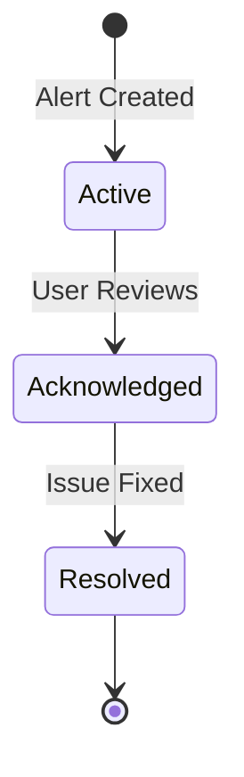

# DRIMS Alert Engine

The DRIMS alert engine provides automated monitoring of inventory conditions, delivery performance, and item expiry.
Alerts are generated by scheduled jobs and can be acknowledged or resolved by users.

## Alert Types

| Code          | Type           | Priority             | Description                                      |
| ------------- | -------------- | -------------------- | ------------------------------------------------ |
| `low_stock`   | Low Stock      | Medium/High          | Stock level below threshold for pending requests |
| `sla_breach`  | SLA Breach     | Critical/High        | Request past due date, not delivered             |
| `sla_warning` | SLA Warning    | Medium/High          | Request approaching due date (within 2 days)     |
| `expiry`      | Expiry Warning | Medium/High/Critical | Items approaching expiration date                |

## Alert States



| State          | Description                   |
| -------------- | ----------------------------- |
| `active`       | New alert requiring attention |
| `acknowledged` | User has seen and is handling |
| `resolved`     | Issue addressed, alert closed |

## Scheduled Jobs (Cron)

### Low Stock Check

**Schedule**: Every 4 hours

**Method**: `_cron_check_low_stock()`

**Logic**:

1. Iterate through DRIMS warehouses
2. For each active incident:
   - Get products with pending/approved requests
   - Calculate quantity needed (requested - delivered)
   - Get available quantity in warehouse
   - If available < 50% of needed, create alert
3. Skip if alert already exists for same product/warehouse/incident

**Threshold**: 50% of pending request quantity

**Priority**:

- `high` - Zero stock available
- `medium` - Some stock but below threshold

### SLA Compliance Check

**Schedule**: Every 2 hours

**Method**: `_cron_check_sla()`

**Logic**:

1. **SLA Breach** (past due):

   - Find requests where `date_needed < today`
   - Exclude delivered or rejected requests
   - Create alert with days overdue

2. **SLA Warning** (at risk):
   - Find requests where `date_needed` within 2 days
   - Exclude dispatched, delivered, or rejected
   - Create warning alert

**Priority** (breach):

- `critical` - More than 7 days overdue
- `high` - 3-7 days overdue
- `medium` - 1-3 days overdue

**Priority** (warning):

- `high` - Due tomorrow or today
- `medium` - Due in 2 days

### Expiry Check

**Schedule**: Daily

**Method**: `_cron_check_expiry()`

**Requires**: `product_expiry` module installed

**Logic**:

1. Find lots with `expiration_date` within 30 days
2. Filter to DRIMS warehouses with stock > 0
3. Create alert for each expiring lot

**Priority**:

- `critical` - Expires within 7 days
- `high` - Expires within 14 days
- `medium` - Expires within 30 days

### KPI Refresh

**Schedule**: Every 15 minutes

**Method**: `_cron_refresh_drims_kpis()`

**Purpose**: Refresh cached KPI values on incidents for dashboard performance.

## Model: spp.drims.alert

Extends `spp.alert` with DRIMS-specific fields.

### Fields

| Field             | Type      | Description                           |
| ----------------- | --------- | ------------------------------------- |
| `reference`       | Char      | Auto-generated (ALT-XXXX)             |
| `alert_type_id`   | Many2one  | Alert type from vocabulary            |
| `priority`        | Selection | low/medium/high/critical              |
| `title`           | Char      | Alert summary                         |
| `description`     | Text      | Detailed alert information            |
| `state`           | Selection | active/acknowledged/resolved          |
| `incident_id`     | Many2one  | Related hazard incident               |
| `warehouse_id`    | Many2one  | Related warehouse                     |
| `product_id`      | Many2one  | Related product                       |
| `request_id`      | Many2one  | Related request (SLA alerts)          |
| `current_value`   | Float     | Current measured value                |
| `threshold_value` | Float     | Threshold that triggered alert        |
| `days_until`      | Integer   | Days until event (negative = overdue) |

## Threshold Configuration

### Incident-Level Overrides

Each incident can override global thresholds:

| Field                  | Default | Description                     |
| ---------------------- | ------- | ------------------------------- |
| `sla_warning_days`     | 2       | Days before due to warn         |
| `expiry_warning_days`  | 30      | Days before expiry to warn      |
| `expiry_critical_days` | 7       | Days before expiry for critical |

Access via `incident.get_threshold('sla_warning_days')`.

### Global Defaults

Set in **Settings > DRIMS**:

- Low stock threshold: 50% of pending requests
- SLA warning: 2 days before due
- Expiry warning: 30 days before expiry

## Warehouse Health Status

Warehouses display health status based on alert counts:

| Status     | Condition                          | Color  |
| ---------- | ---------------------------------- | ------ |
| `critical` | 3+ active alerts OR <10% capacity  | Red    |
| `warning`  | 1-2 active alerts OR <30% capacity | Orange |
| `good`     | No active alerts, adequate stock   | Green  |

Fields:

- `drims_stock_health` - Computed health status
- `drims_active_alert_count` - Count of active alerts
- `drims_critical_alert_count` - Count of critical/high priority alerts

## Activity Feed

All DRIMS alert changes are logged via `spp_audit`:

- Alert created
- Alert acknowledged
- Alert resolved
- Priority changes

View in **DRIMS > Activity Feed**.

## Manual Alert Creation

Users can create alerts manually from:

- **DRIMS > Operations > Alerts > Create**
- Warehouse form (smart button)
- Request form (for SLA issues)

## API Usage

### Check alerts for a warehouse

```python
alerts = env['spp.drims.alert'].search([
    ('warehouse_id', '=', warehouse.id),
    ('state', '=', 'active'),
])
```

### Acknowledge an alert

```python
alert.action_acknowledge()
```

### Resolve an alert

```python
alert.action_resolve()
```

### Run alert checks manually

```python
# Low stock
env['spp.drims.alert']._cron_check_low_stock()

# SLA
env['spp.drims.alert']._cron_check_sla()

# Expiry
env['spp.drims.alert']._cron_check_expiry()
```

## Performance Considerations

The alert engine uses batch SQL operations to avoid N+1 query patterns:

- Product quantities aggregated in single queries
- Existing alerts checked in batch before creation
- Alerts created in batch using `create_multi`

This ensures the cron jobs complete efficiently even with large datasets.
