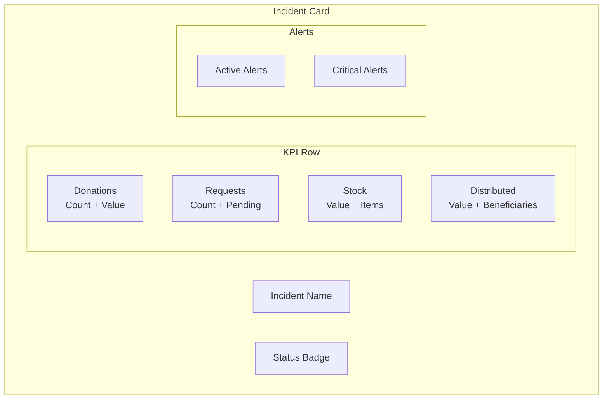
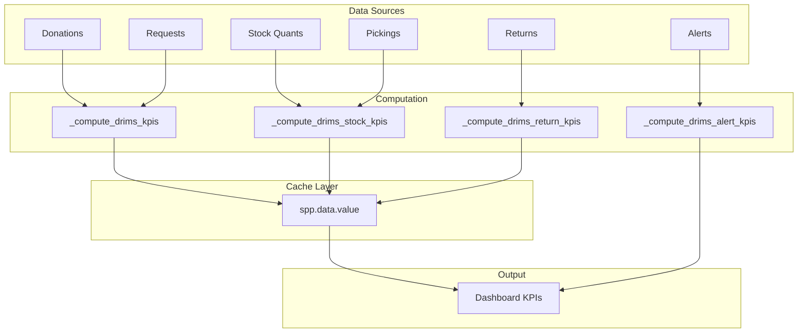
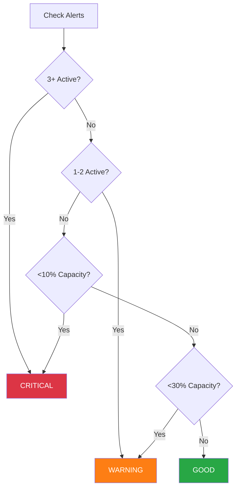

# DRIMS Dashboards & KPIs

The DRIMS dashboard provides real-time visibility into disaster response operations
through Key Performance Indicators (KPIs) displayed on incident cards and warehouse
views.

## Dashboard Views

### Incident Dashboard (Kanban)

**Location**: DRIMS > Dashboard

Displays active incidents as cards with embedded KPIs:



### Warehouse Dashboard

**Location**: DRIMS > Inventory > Warehouses

Shows warehouse health indicators and stock status:

| Indicator | Color  | Condition                          |
| --------- | ------ | ---------------------------------- |
| Critical  | Red    | 3+ active alerts OR <10% capacity  |
| Warning   | Orange | 1-2 active alerts OR <30% capacity |
| Good      | Green  | No active alerts, adequate stock   |

## KPI Definitions

### Incident-Level KPIs

| KPI                      | Field                        | Calculation                                          | Update Frequency |
| ------------------------ | ---------------------------- | ---------------------------------------------------- | ---------------- |
| **Donations**            | `drims_donation_count`       | Count of linked donations                            | Real-time        |
| **Donation Value**       | `drims_donation_value`       | Sum of `total_value` from donations                  | Cached (1 hour)  |
| **Requests**             | `drims_request_count`        | Count of linked requests                             | Real-time        |
| **Pending Requests**     | `drims_request_pending`      | Count where `approval_state` in (draft, pending)     | Real-time        |
| **Stock Value**          | `drims_stock_value`          | Sum of (qty × unit_cost) for warehouse stock         | Cached (30 min)  |
| **Stock Items**          | `drims_stock_item_count`     | Distinct products in stock                           | Real-time        |
| **Total Units**          | `drims_total_stock_units`    | Sum of all quantities in stock                       | Real-time        |
| **Distributed Value**    | `drims_distributed_value`    | Sum of (qty × unit_cost) from completed dispatches   | Cached (30 min)  |
| **Beneficiaries Served** | `drims_beneficiaries_served` | Sum of `beneficiary_count` from dispatches (30 days) | Real-time        |
| **Active Alerts**        | `drims_alert_count`          | Count of active/acknowledged alerts                  | Real-time        |
| **Critical Alerts**      | `drims_critical_alert_count` | Count of critical priority alerts                    | Real-time        |
| **Returns**              | `drims_return_count`         | Count of linked returns                              | Real-time        |
| **Return Value**         | `drims_return_value`         | Sum of `total_value` from returns                    | Cached (1 hour)  |

### Warehouse-Level KPIs

| KPI                   | Field                        | Calculation                           |
| --------------------- | ---------------------------- | ------------------------------------- |
| **Stock Health**      | `drims_stock_health`         | good/warning/critical based on alerts |
| **Active Alerts**     | `drims_active_alert_count`   | Count of active alerts for warehouse  |
| **Critical Alerts**   | `drims_critical_alert_count` | Count of critical/high alerts         |
| **Stock Utilization** | `drims_stock_utilization`    | % of capacity used                    |

## KPI Calculation Flow



## Caching Strategy

Expensive KPIs are cached in `spp.data.value` to avoid real-time computation:

### Cached Values

| Variable                  | TTL    | Description                     |
| ------------------------- | ------ | ------------------------------- |
| `drims_donation_value`    | 1 hour | Sum of donation values          |
| `drims_stock_value`       | 30 min | Aggregate warehouse stock value |
| `drims_distributed_value` | 30 min | Aggregate distributed value     |
| `drims_return_value`      | 1 hour | Sum of return values            |

### Cache Refresh

**Cron Job**: `DRIMS: Refresh KPI Cache` **Frequency**: Every 15 minutes **Method**:
`_cron_refresh_drims_kpis()`

The cron job:

1. Finds all non-closed incidents
2. Computes expensive KPIs
3. Stores in `spp.data.value` with TTL
4. Dashboard reads from cache (with fallback to direct compute)

### Hybrid Approach

```python
# Try cache first
cached_values = DataValue.read_values(
    "drims_stock_value",
    self.ids,
    period_key="current",
)

# Fallback to direct computation on cache miss
if rec.id in cached_values:
    rec.drims_stock_value = cached_values[rec.id]
else:
    rec.drims_stock_value = self._compute_stock_value_direct()
```

## Visual Indicators

### Dashboard Card Styling

| Element          | Condition       | Style                        |
| ---------------- | --------------- | ---------------------------- |
| Pending Requests | > 0             | Orange border + warning icon |
| Critical Alerts  | > 0             | Red border + danger badge    |
| Active Alerts    | > 0             | Orange badge                 |
| Zero Stock       | stock_value = 0 | Gray muted text              |

### Warehouse Health Badge



## API Usage

### Get KPIs for Incident

```python
incident = env['spp.hazard.incident'].browse(incident_id)

# Access KPIs directly (uses cache if available)
print(f"Stock Value: {incident.drims_stock_value}")
print(f"Distributed: {incident.drims_distributed_value}")
print(f"Alerts: {incident.drims_alert_count}")
```

### Force KPI Refresh

```python
# Refresh cache for specific incidents
incidents._refresh_incident_kpi_cache()

# Trigger cron manually
env['spp.hazard.incident']._cron_refresh_drims_kpis()
```

### Get Warehouse Health

```python
warehouse = env['stock.warehouse'].browse(warehouse_id)
print(f"Health: {warehouse.drims_stock_health}")
print(f"Alert Count: {warehouse.drims_active_alert_count}")
```

## Customizing KPIs

### Adding a New KPI

1. Add field to `hazard_incident.py`:

```python
drims_new_kpi = fields.Float(
    compute="_compute_drims_new_kpi",
    store=True,
)
```

2. Add compute method:

```python
@api.depends("drims_donation_ids", ...)
def _compute_drims_new_kpi(self):
    for rec in self:
        rec.drims_new_kpi = ...
```

3. Add to dashboard view:

```xml
<field name="drims_new_kpi" />
```

4. (Optional) Add to cache refresh in `_refresh_incident_kpi_cache()`

### Adding to Warehouse Health

Modify `_compute_drims_stock_health()` in `stock_warehouse.py`:

```python
def _compute_drims_stock_health(self):
    for warehouse in self:
        if warehouse.drims_critical_alert_count >= 3:
            warehouse.drims_stock_health = 'critical'
        elif warehouse.drims_active_alert_count >= 1:
            warehouse.drims_stock_health = 'warning'
        # Add custom conditions here
        else:
            warehouse.drims_stock_health = 'good'
```

## Performance Considerations

### For Large Incidents

- KPIs use stored computed fields (updated on dependency change)
- Expensive calculations are cached with TTL
- Batch SQL queries avoid N+1 patterns

### Monitoring

Check cache hit/miss in logs:

```
DEBUG Cache hit for drims_stock_value on incident 123
DEBUG Cache miss for drims_donation_value on incident 456
```

### Tuning

Adjust cache TTL in `_refresh_incident_kpi_cache()`:

- Increase TTL for stable data (donations, returns)
- Decrease TTL for volatile data (stock, dispatches)

## Related Documentation

- [ALERTS.md](ALERTS.md) - Alert engine and health indicators
- [INTEGRATION.md](INTEGRATION.md) - spp.data.value cache integration
