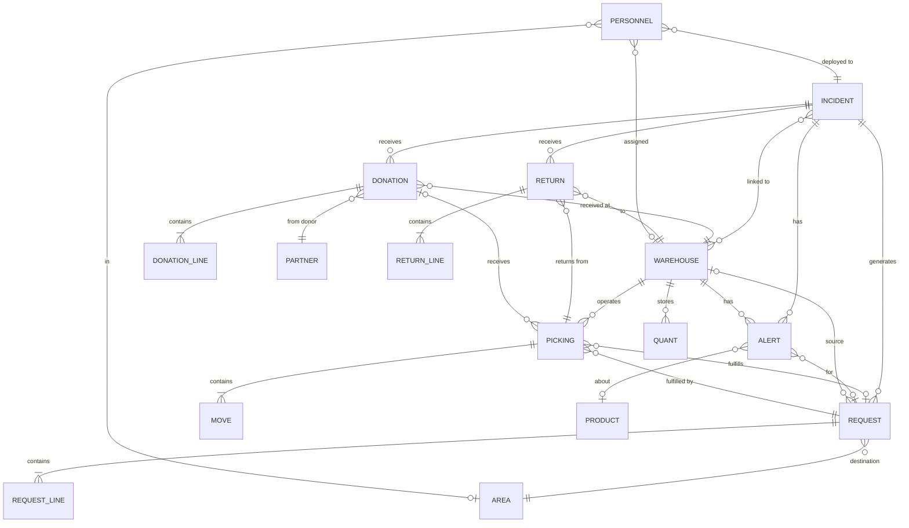
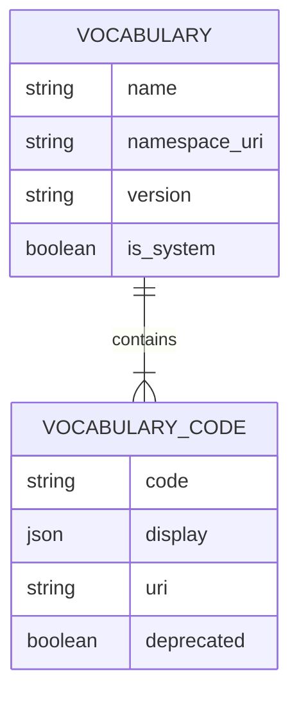

# DRIMS Data Model

This document describes the entity relationships and key fields in the DRIMS data model.

## Entity Relationship Diagram

## Core Models

### spp.drims.donation

Represents incoming relief supplies from donors.

| Field            | Type     | Description                          |
| ---------------- | -------- | ------------------------------------ |
| `reference`      | Char     | Auto-generated (DON-XXXX)            |
| `incident_id`    | Many2one | Linked incident                      |
| `donor_id`       | Many2one | Donor partner                        |
| `donor_name`     | Char     | Donor name (if not in system)        |
| `source_type_id` | Many2one | Donor type vocabulary                |
| `warehouse_id`   | Many2one | Receiving warehouse                  |
| `state`          | Char     | announced/received/inspected/stocked |
| `date_announced` | Date     | Pledge date                          |
| `date_received`  | Date     | Arrival date                         |
| `line_ids`       | One2many | Donation items                       |
| `total_value`    | Float    | Computed total                       |
| `picking_ids`    | One2many | Stock receipts                       |

### spp.drims.donation.line

Individual items within a donation.

| Field               | Type     | Description       |
| ------------------- | -------- | ----------------- |
| `donation_id`       | Many2one | Parent donation   |
| `product_id`        | Many2one | Product           |
| `quantity_pledged`  | Float    | Promised quantity |
| `quantity_received` | Float    | Actual received   |
| `uom_id`            | Many2one | Unit of measure   |
| `unit_value`        | Float    | Per-unit value    |
| `condition_id`      | Many2one | Item condition    |

### spp.drims.request

Relief supply requests from field locations.

| Field                 | Type      | Description                     |
| --------------------- | --------- | ------------------------------- |
| `reference`           | Char      | Auto-generated (REQ-XXXX)       |
| `incident_id`         | Many2one  | Linked incident                 |
| `destination_area_id` | Many2one  | Delivery area                   |
| `cluster_id`          | Many2one  | OCHA humanitarian cluster       |
| `priority_id`         | Many2one  | Priority level                  |
| `is_life_threatening` | Boolean   | Emergency flag                  |
| `date_requested`      | Date      | Request date                    |
| `date_needed`         | Date      | Required by date                |
| `approval_state`      | Selection | draft/pending/approved/rejected |
| `state_id`            | Many2one  | Fulfillment state               |
| `source_warehouse_id` | Many2one  | Fulfilling warehouse            |
| `requester_id`        | Many2one  | Requesting user                 |
| `affected_population` | Integer   | People to serve                 |
| `line_ids`            | One2many  | Requested items                 |
| `picking_ids`         | One2many  | Dispatch pickings               |

### spp.drims.request.line

Individual items within a request.

| Field                | Type     | Description     |
| -------------------- | -------- | --------------- |
| `request_id`         | Many2one | Parent request  |
| `product_id`         | Many2one | Product         |
| `quantity_requested` | Float    | Requested qty   |
| `quantity_delivered` | Float    | Delivered qty   |
| `uom_id`             | Many2one | Unit of measure |

### spp.drims.return

Items returned from distribution points.

| Field               | Type      | Description                                  |
| ------------------- | --------- | -------------------------------------------- |
| `reference`         | Char      | Auto-generated (RET-XXXX)                    |
| `incident_id`       | Many2one  | Linked incident                              |
| `source_picking_id` | Many2one  | Original dispatch                            |
| `warehouse_id`      | Many2one  | Receiving warehouse                          |
| `reason_id`         | Many2one  | Return reason                                |
| `state`             | Selection | draft/confirmed/received/inspected/restocked |
| `line_ids`          | One2many  | Returned items                               |

### spp.drims.alert

Automated monitoring alerts.

| Field             | Type      | Description                  |
| ----------------- | --------- | ---------------------------- |
| `reference`       | Char      | Auto-generated (ALT-XXXX)    |
| `alert_type_id`   | Many2one  | Alert type vocabulary        |
| `priority`        | Selection | low/medium/high/critical     |
| `title`           | Char      | Alert summary                |
| `description`     | Text      | Details                      |
| `state`           | Selection | active/acknowledged/resolved |
| `incident_id`     | Many2one  | Related incident             |
| `warehouse_id`    | Many2one  | Related warehouse            |
| `product_id`      | Many2one  | Related product              |
| `request_id`      | Many2one  | Related request              |
| `current_value`   | Float     | Measured value               |
| `threshold_value` | Float     | Trigger threshold            |
| `days_until`      | Integer   | Days until/since event       |

### spp.drims.personnel

Deployed staff tracking.

| Field                | Type      | Description                        |
| -------------------- | --------- | ---------------------------------- |
| `name`               | Char      | Person name                        |
| `incident_id`        | Many2one  | Deployment incident                |
| `organization_id`    | Many2one  | Employing organization             |
| `role_id`            | Many2one  | Personnel role                     |
| `cluster_id`         | Many2one  | OCHA cluster                       |
| `deployment_area_id` | Many2one  | Location                           |
| `warehouse_id`       | Many2one  | Assigned warehouse                 |
| `phone`              | Char      | Contact phone                      |
| `email`              | Char      | Contact email                      |
| `deployment_date`    | Date      | Start date                         |
| `status`             | Selection | deployed/standby/on_leave/returned |
| `days_deployed`      | Integer   | Computed days                      |

## Extended Models

### spp.hazard.incident (Extended)

DRIMS adds to the hazard incident model:

| Field                        | Type     | Description               |
| ---------------------------- | -------- | ------------------------- |
| `coordination_mode_id`       | Many2one | Multi-agency mode         |
| `drims_donation_count`       | Integer  | KPI: Donation count       |
| `drims_donation_value`       | Float    | KPI: Total donation value |
| `drims_request_count`        | Integer  | KPI: Request count        |
| `drims_request_pending`      | Integer  | KPI: Pending requests     |
| `drims_stock_value`          | Float    | KPI: Stock value          |
| `drims_distributed_value`    | Float    | KPI: Distributed value    |
| `drims_beneficiaries_served` | Integer  | KPI: People served        |
| `drims_alert_count`          | Integer  | KPI: Active alerts        |
| Threshold overrides          | Various  | Alert threshold settings  |

### stock.warehouse (Extended)

| Field                      | Type      | Description             |
| -------------------------- | --------- | ----------------------- |
| `is_drims_warehouse`       | Boolean   | Enable for DRIMS        |
| `tier`                     | Selection | central/regional/mobile |
| `incident_ids`             | Many2many | Linked incidents        |
| `area_id`                  | Many2one  | Geographic location     |
| `drims_stock_health`       | Selection | good/warning/critical   |
| `drims_active_alert_count` | Integer   | Alert count             |

### stock.picking (Extended)

| Field                 | Type     | Description        |
| --------------------- | -------- | ------------------ |
| `drims_type_id`       | Many2one | Transaction type   |
| `drims_type`          | Char     | Related code       |
| `incident_id`         | Many2one | Linked incident    |
| `drims_request_id`    | Many2one | Source request     |
| `beneficiary_area_id` | Many2one | Delivery area      |
| `beneficiary_count`   | Integer  | People served      |
| `date_departed`       | Datetime | Shipment departure |
| `date_arrived`        | Datetime | Shipment arrival   |
| `pod_received_by`     | Char     | Receiver name      |
| `pod_receiver_title`  | Char     | Receiver title     |
| `pod_signature`       | Binary   | Signature image    |
| `pod_confirmed`       | Boolean  | POD complete       |

### res.users (Extended)

| Field                 | Type      | Description         |
| --------------------- | --------- | ------------------- |
| `drims_area_ids`      | Many2many | Assigned areas      |
| `drims_warehouse_ids` | Many2many | Assigned warehouses |

### res.partner (Extended)

| Field                        | Type     | Description       |
| ---------------------------- | -------- | ----------------- |
| `is_drims_organization`      | Boolean  | Is DRIMS partner  |
| `drims_organization_role_id` | Many2one | Organization role |

## Vocabulary Structures

### Standard Pattern

### DRIMS Vocabularies

| Namespace URI                             | Purpose              |
| ----------------------------------------- | -------------------- |
| `urn:openspp:vocab:drims:priority-levels` | Request priority     |
| `urn:openspp:vocab:drims:donor-types`     | Donor classification |
| `urn:openspp:vocab:drims:item-conditions` | Item quality         |
| `urn:openspp:vocab:drims:drims-types`     | Transaction types    |
| `urn:openspp:vocab:drims:alert-types`     | Alert categories     |
| `urn:ocha:iasc:clusters`                  | Humanitarian sectors |
| `urn:openspp:vocab:drims:personnel-roles` | Staff roles          |

## Indexes

Key indexed fields for performance:

| Model                 | Indexed Fields                                                       |
| --------------------- | -------------------------------------------------------------------- |
| `spp.drims.donation`  | `incident_id`, `warehouse_id`, `state`                               |
| `spp.drims.request`   | `incident_id`, `destination_area_id`, `cluster_id`, `approval_state` |
| `spp.drims.alert`     | `incident_id`, `warehouse_id`, `product_id`, `state`                 |
| `spp.drims.personnel` | `incident_id`, `status`                                              |
| `stock.picking`       | `incident_id`, `drims_type`                                          |

## Sequence Definitions

| Model    | Sequence Prefix | Example   |
| -------- | --------------- | --------- |
| Donation | DON-            | DON-00001 |
| Request  | REQ-            | REQ-00001 |
| Return   | RET-            | RET-00001 |
| Alert    | ALT-            | ALT-00001 |

## Related Documentation

- [WORKFLOWS.md](WORKFLOWS.md) - State transitions
- [INTEGRATION.md](INTEGRATION.md) - Model extensions
- [SECURITY.md](SECURITY.md) - Access rules per model
