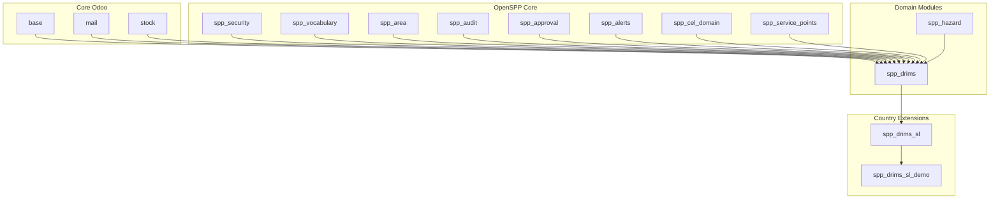
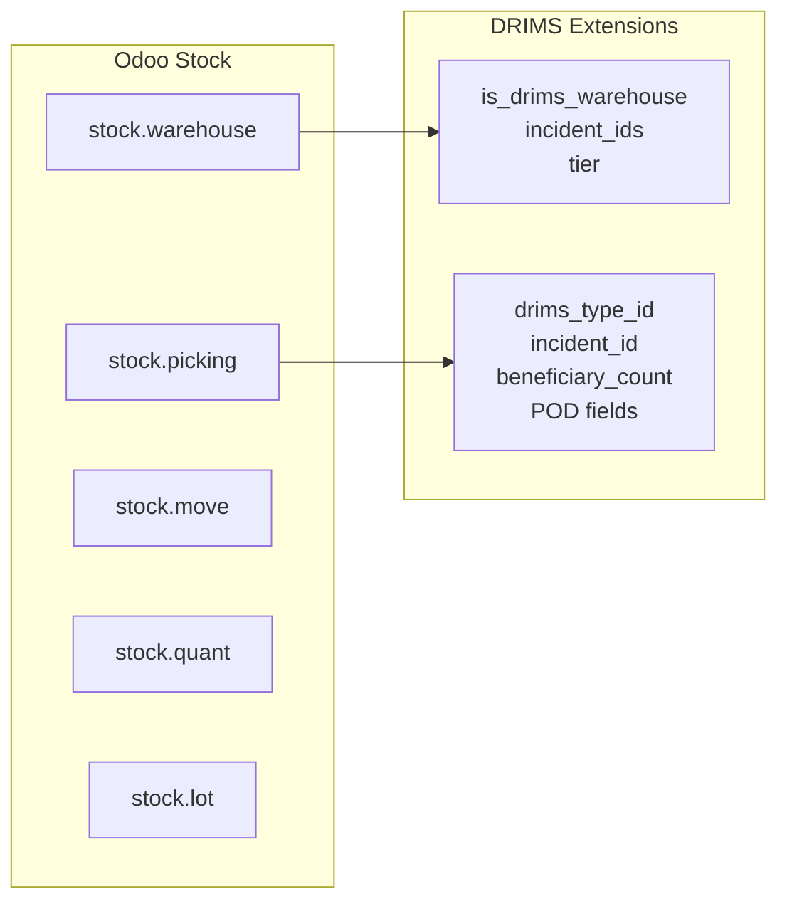

# DRIMS Module Integration

DRIMS integrates with multiple OpenSPP and Odoo modules to provide a complete disaster
response inventory management solution.

## Dependency Graph



## Module Dependencies

### Core Odoo Modules

| Module  | Purpose in DRIMS                          |
| ------- | ----------------------------------------- |
| `base`  | Base models (res.partner, res.users)      |
| `mail`  | Chatter, activity tracking, notifications |
| `stock` | Warehouse, pickings, quants, lots         |

### OpenSPP Modules

| Module               | Purpose in DRIMS                                        |
| -------------------- | ------------------------------------------------------- |
| `spp_security`       | Security groups and category                            |
| `spp_vocabulary`     | Controlled vocabularies (donor types, priorities, etc.) |
| `spp_area`           | Geographic hierarchy (provinces, districts)             |
| `spp_hazard`         | Disaster incident management                            |
| `spp_service_points` | Distribution points                                     |
| `spp_approval`       | Approval workflow mixin                                 |
| `spp_audit`          | Audit trail logging                                     |
| `spp_alerts`         | Base alert model                                        |
| `spp_cel_domain`     | CEL expression variables                                |
| `queue_job`          | Background job processing                               |

## Integration Details

### spp_hazard

DRIMS extends `spp.hazard.incident` with:

```python
class HazardIncident(models.Model):
    _inherit = "spp.hazard.incident"

    # DRIMS KPIs
    drims_donation_count = fields.Integer(...)
    drims_stock_value = fields.Float(...)

    # Related records
    drims_donation_ids = fields.One2many("spp.drims.donation", ...)
    drims_request_ids = fields.One2many("spp.drims.request", ...)
```

**Integration Points**:

- Donations linked to incidents
- Requests linked to incidents
- Alerts linked to incidents
- Dashboard shows incident KPIs

### stock (Odoo Inventory)

DRIMS extends stock models:



**stock.warehouse Extensions**:

- `is_drims_warehouse` - Enable for DRIMS operations
- `tier` - Central/Regional/Mobile classification
- `incident_ids` - Linked incidents
- `drims_stock_health` - Health indicator

**stock.picking Extensions**:

- `drims_type_id` - Transaction type (donation_receipt, request_dispatch, etc.)
- `incident_id` - Linked incident
- `beneficiary_count` - People served
- `beneficiary_area_id` - Delivery location
- POD fields (proof of delivery)

### spp_vocabulary

DRIMS defines 18+ vocabulary namespaces:

| Namespace                                    | Purpose                    |
| -------------------------------------------- | -------------------------- |
| `urn:openspp:vocab:drims:priority-levels`    | Request priorities         |
| `urn:openspp:vocab:drims:donor-types`        | Donor classifications      |
| `urn:openspp:vocab:drims:item-conditions`    | Item quality states        |
| `urn:openspp:vocab:drims:transport-modes`    | Shipping methods           |
| `urn:openspp:vocab:drims:request-states`     | Request fulfillment states |
| `urn:openspp:vocab:drims:donation-states`    | Donation processing states |
| `urn:openspp:vocab:drims:drims-types`        | Transaction types          |
| `urn:openspp:vocab:drims:alert-types`        | Alert classifications      |
| `urn:openspp:vocab:drims:coordination-modes` | Multi-agency modes         |
| `urn:ocha:iasc:clusters`                     | OCHA humanitarian clusters |
| `urn:openspp:vocab:drims:personnel-roles`    | Staff roles                |

### spp_area

DRIMS uses areas for:

- Request destination (`destination_area_id`)
- Dispatch delivery (`beneficiary_area_id`)
- Personnel deployment (`deployment_area_id`)
- Security scoping (`user.drims_area_ids`)

**Hierarchy Support**: Uses `child_of` operator for cascading access.

### spp_approval

Requests inherit `spp.approval.mixin`:

```python
class DrimsRequest(models.Model):
    _inherit = ["mail.thread", "mail.activity.mixin", "spp.approval.mixin"]

    approval_state = fields.Selection(...)  # From mixin
```

**Workflow States**:

- draft → pending → approved/rejected/revision

### spp_audit

DRIMS configures audit rules in `data/audit_rules.xml`:

| Model                | Tracked Fields                               |
| -------------------- | -------------------------------------------- |
| `spp.drims.donation` | state, incident, warehouse, value            |
| `spp.drims.request`  | state, approval_state, priority, date_needed |
| `spp.drims.alert`    | state, priority                              |
| `stock.picking`      | state, drims_type, beneficiary_count         |

View audit logs in **DRIMS > Activity Feed**.

### spp_alerts

DRIMS extends `spp.alert`:

```python
class DrimsAlert(models.Model):
    _name = "spp.drims.alert"
    _inherit = "spp.alert"

    # DRIMS-specific fields
    incident_id = fields.Many2one("spp.hazard.incident", ...)
    warehouse_id = fields.Many2one("stock.warehouse", ...)
    product_id = fields.Many2one("product.product", ...)
    request_id = fields.Many2one("spp.drims.request", ...)
```

### spp_cel_domain

DRIMS registers CEL variables for dynamic domains:

| Variable                      | Type    | Source              |
| ----------------------------- | ------- | ------------------- |
| `request.total_value`         | Float   | Request total value |
| `request.priority`            | String  | Priority code       |
| `request.is_life_threatening` | Boolean | Emergency flag      |

Used in approval rules and dynamic conditions.

### queue_job

Long-running operations use `queue_job`:

- Area imports from Excel
- Bulk operations
- KPI refresh (background)

## Country Extensions

### spp_drims_sl (Sri Lanka)

Extends DRIMS with Sri Lanka-specific:

- Area types (Province, District, DS Division, GN Division)
- Warehouse network (11 provincial warehouses)
- Hazard categories (Flood, Drought, Landslide, etc.)
- Partner agencies (UNICEF, WFP, Red Cross, etc.)

### spp_drims_sl_demo

Demo data generator for Sri Lanka:

- Imports official admin boundary data
- Creates realistic incidents
- Generates donations, requests, dispatches
- Creates demo users with roles

## Extension Points

### Adding Custom Fields

Extend DRIMS models using inheritance:

```python
class DrimsRequestExtension(models.Model):
    _inherit = "spp.drims.request"

    custom_field = fields.Char(string="Custom")
```

### Adding Vocabulary Codes

Create XML data files:

```xml
<record id="my_vocab_code" model="spp.vocabulary.code">
  <field name="code">my_code</field>
  <field name="display">{"en_US": "My Code"}</field>
  <field name="vocabulary_id" ref="spp_drims.vocab_drims_priority" />
</record>
```

### Custom Alert Types

Add to `urn:openspp:vocab:drims:alert-types` vocabulary and implement cron check method.

### Custom Approval Rules

Use CEL expressions in `spp_approval` to define custom approval workflows based on
request values.

## API Integration

### External Systems

DRIMS data can be accessed via Odoo's standard APIs:

- XML-RPC
- JSON-RPC
- REST API (with custom controller or `rest_framework`)

### Webhook Integration

Use `mail.thread` to trigger notifications:

```python
request.message_post(
    body="Request approved",
    message_type="notification",
)
```

### Mobile Integration

DRIMS integrates with IDPass DataCollect for offline mobile operations:

- Field data collection
- POD confirmation
- Stock counts

## Related Documentation

- [DASHBOARDS.md](DASHBOARDS.md) - KPI caching with spp.data.value
- [SECURITY.md](SECURITY.md) - Security group integration
- [COORDINATION.md](COORDINATION.md) - Vocabulary usage
