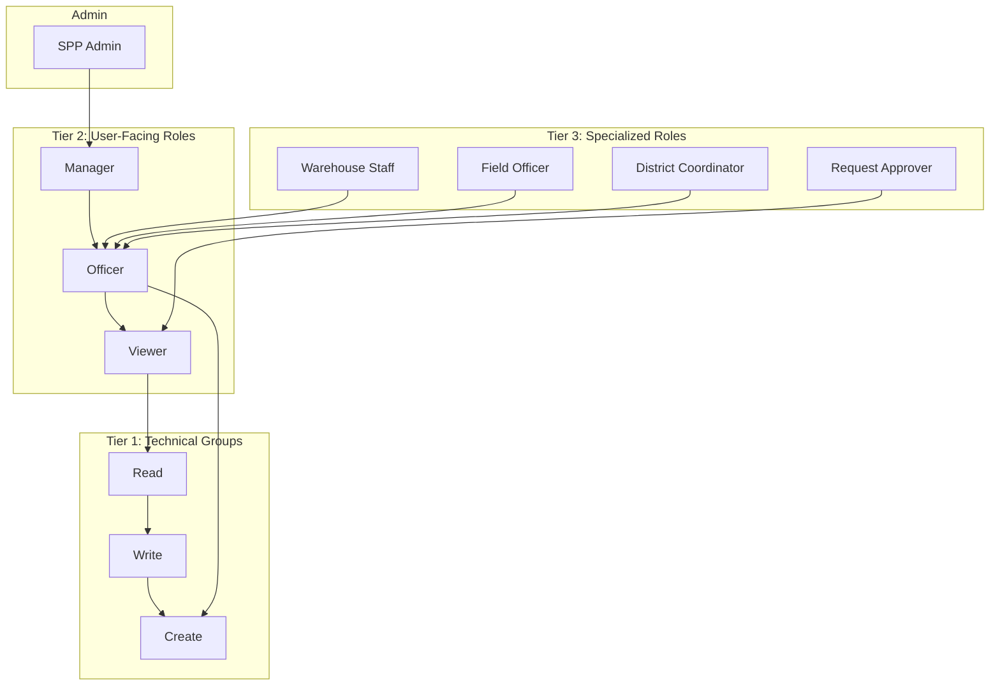
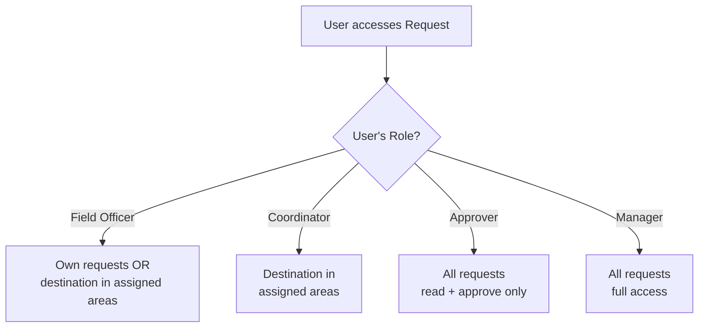
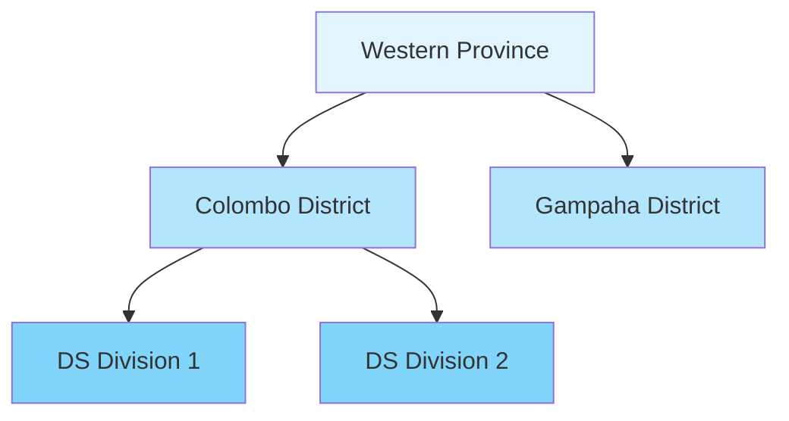

# DRIMS Security Model

DRIMS implements a three-tier security architecture with role-based access control,
area/warehouse scoping, and multi-company isolation.

## Security Architecture



## Security Groups

### Technical Groups (Internal)

| Group                | Permissions           | Purpose                 |
| -------------------- | --------------------- | ----------------------- |
| `group_drims_read`   | Read only             | Base read access        |
| `group_drims_write`  | Read + Write          | Modify existing records |
| `group_drims_create` | Read + Write + Create | Create new records      |

### User-Facing Roles

| Group                 | Inherits        | Description                         |
| --------------------- | --------------- | ----------------------------------- |
| `group_drims_viewer`  | Read            | View-only access to all DRIMS data  |
| `group_drims_officer` | Create + Viewer | Create and manage operations        |
| `group_drims_manager` | Officer         | Full access including configuration |

### Specialized Roles

| Group                         | Inherits | Purpose                                          |
| ----------------------------- | -------- | ------------------------------------------------ |
| `group_drims_warehouse_staff` | Officer  | Inventory operations at assigned warehouses      |
| `group_drims_field_officer`   | Officer  | Field requests in assigned areas                 |
| `group_drims_coordinator`     | Officer  | District-level coordination                      |
| `group_drims_approver`        | Viewer   | Approve/reject requests (read + approve actions) |

## Role Capabilities Matrix

| Capability         | Viewer | Officer | Warehouse | Field | Coordinator | Approver | Manager |
| ------------------ | ------ | ------- | --------- | ----- | ----------- | -------- | ------- |
| View donations     | ✓      | ✓       | ✓         | ✓     | ✓           | ✓        | ✓       |
| Create donations   |        | ✓       | ✓         |       |             |          | ✓       |
| Process donations  |        |         | ✓         |       |             |          | ✓       |
| View requests      | ✓      | ✓       | ✓         | ✓     | ✓           | ✓        | ✓       |
| Create requests    |        | ✓       |           | ✓     | ✓           |          | ✓       |
| Approve requests   |        |         |           |       |             | ✓        | ✓       |
| View dispatches    | ✓      | ✓       | ✓         | ✓     | ✓           | ✓        | ✓       |
| Create dispatches  |        |         | ✓         |       |             |          | ✓       |
| Confirm POD        |        |         | ✓         | ✓     |             |          | ✓       |
| View alerts        | ✓      | ✓       | ✓         | ✓     | ✓           | ✓        | ✓       |
| Acknowledge alerts |        | ✓       | ✓         | ✓     | ✓           |          | ✓       |
| Resolve alerts     |        |         | ✓         |       | ✓           |          | ✓       |
| Delete records     |        |         |           |       |             |          | ✓       |
| Configuration      |        |         |           |       |             |          | ✓       |

## Record Rules (Row-Level Security)

Record rules restrict which records users can access based on their role and
assignments.

### Request Scoping



| Rule                | Group                       | Scope                                                    | Permissions             |
| ------------------- | --------------------------- | -------------------------------------------------------- | ----------------------- |
| Field Officer Scope | `group_drims_field_officer` | Own records OR destination area in `user.drims_area_ids` | Read, Write, Create     |
| Coordinator Scope   | `group_drims_coordinator`   | Destination area in `user.drims_area_ids`                | Read, Write, Create     |
| Approver All        | `group_drims_approver`      | All requests                                             | Read, Write (no Create) |
| Manager All         | `group_drims_manager`       | All requests                                             | Full CRUD               |

### Donation Scoping

| Rule            | Group                         | Scope                                                  | Permissions         |
| --------------- | ----------------------------- | ------------------------------------------------------ | ------------------- |
| Warehouse Scope | `group_drims_warehouse_staff` | Own records OR warehouse in `user.drims_warehouse_ids` | Read, Write, Create |
| Manager All     | `group_drims_manager`         | All donations                                          | Full CRUD           |

### Alert Scoping

| Rule            | Group                         | Scope                           | Permissions |
| --------------- | ----------------------------- | ------------------------------- | ----------- |
| Field Officer   | `group_drims_field_officer`   | Warehouse OR request area scope | Read, Write |
| Coordinator     | `group_drims_coordinator`     | Warehouse OR request area scope | Read, Write |
| Warehouse Staff | `group_drims_warehouse_staff` | Warehouse in assignments        | Read, Write |
| Manager All     | `group_drims_manager`         | All alerts                      | Full CRUD   |

### Return Scoping

| Rule            | Group                         | Scope                          | Permissions         |
| --------------- | ----------------------------- | ------------------------------ | ------------------- |
| Field Officer   | `group_drims_field_officer`   | Own records OR warehouse scope | Read, Write, Create |
| Coordinator     | `group_drims_coordinator`     | Warehouse scope                | Read, Write, Create |
| Warehouse Staff | `group_drims_warehouse_staff` | Warehouse scope                | Read, Write, Create |
| Manager All     | `group_drims_manager`         | All returns                    | Full CRUD           |

## User Assignments

Users are assigned to areas and warehouses via fields on `res.users`:

| Field                 | Type      | Purpose                                |
| --------------------- | --------- | -------------------------------------- |
| `drims_area_ids`      | Many2many | Areas user can access (uses hierarchy) |
| `drims_warehouse_ids` | Many2many | Warehouses user can access             |

### Area Hierarchy

Area scoping uses `child_of` operator, meaning:

- User assigned to "Western Province" can see all districts within
- User assigned to "Colombo District" can see all DS divisions within



## Multi-Company Isolation

All DRIMS models have global rules for multi-company environments:

```python
domain_force = [
    '|',
    ('company_id', '=', False),
    ('company_id', 'in', company_ids)
]
```

This ensures users only see records for their allowed companies.

## Menu Visibility

Certain menu items are restricted by group:

| Menu               | Required Group         |
| ------------------ | ---------------------- |
| Pending Approval   | `group_drims_approver` |
| Product Categories | `group_drims_manager`  |
| Configuration      | `group_drims_manager`  |

## Field-Level Security

Some fields have `groups` attribute restricting visibility:

| Field                | Model    | Groups                                        |
| -------------------- | -------- | --------------------------------------------- |
| `total_value`        | Request  | `group_drims_approver`, `group_drims_manager` |
| Configuration fields | Settings | `group_drims_manager`                         |

## Approval Workflow Security

The approval workflow uses `spp.approval.mixin` which enforces:

- Only users with `group_drims_approver` can approve/reject
- Requesters cannot approve their own requests
- Approval actions are logged in chatter

## Audit Trail

All DRIMS operations are logged via `spp_audit`:

- Record creation, modification, deletion
- State changes (workflow transitions)
- Approval decisions

View audit logs in **DRIMS > Activity Feed**.

## Best Practices

### Setting Up Users

1. Assign base role (Officer, Warehouse Staff, Field Officer, etc.)
2. Assign geographic areas (`drims_area_ids`)
3. Assign warehouses if needed (`drims_warehouse_ids`)
4. Add Approver group if user should approve requests

### Example Configurations

**Field Officer in Colombo District**:

```
Groups: DRIMS Field Officer
Areas: Colombo District
Warehouses: (none - not needed)
```

**Warehouse Manager in Galle**:

```
Groups: DRIMS Warehouse Staff
Areas: Southern Province
Warehouses: Southern Province Warehouse - Galle
```

**Regional Coordinator**:

```
Groups: DRIMS District Coordinator, DRIMS Request Approver
Areas: Western Province
Warehouses: (all in region)
```

**National Manager**:

```
Groups: DRIMS Manager
Areas: (none - sees all via manager rule)
Warehouses: (none - sees all via manager rule)
```
