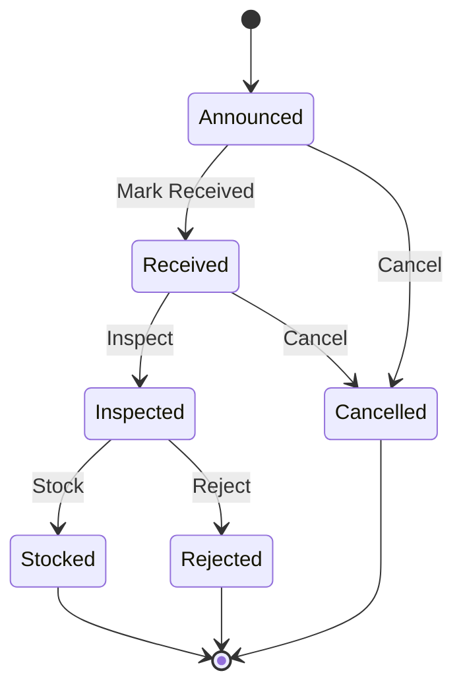
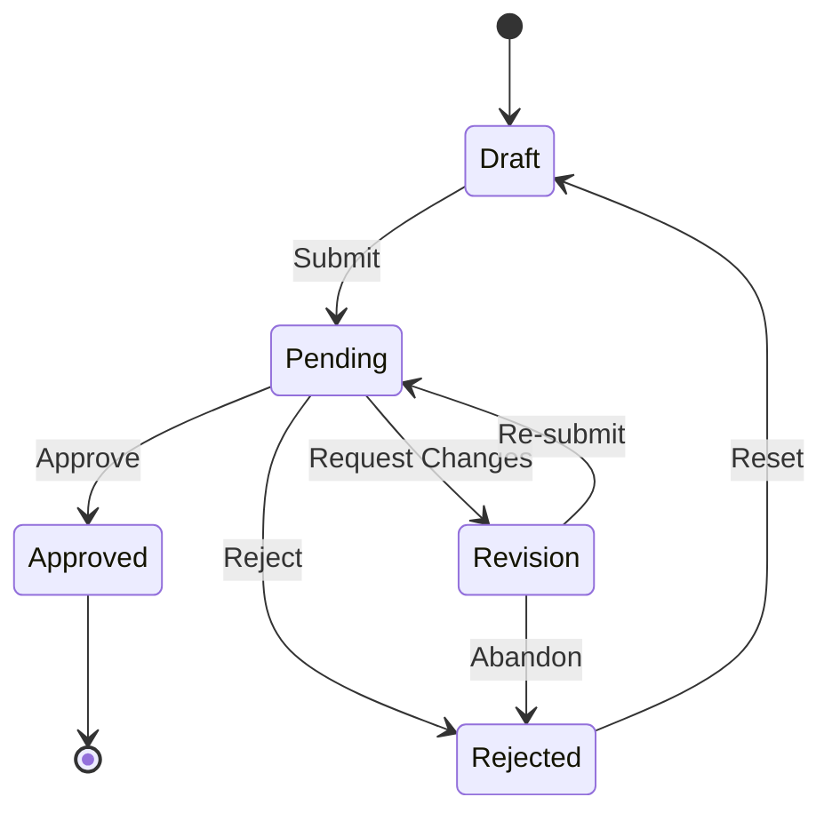
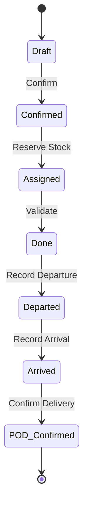
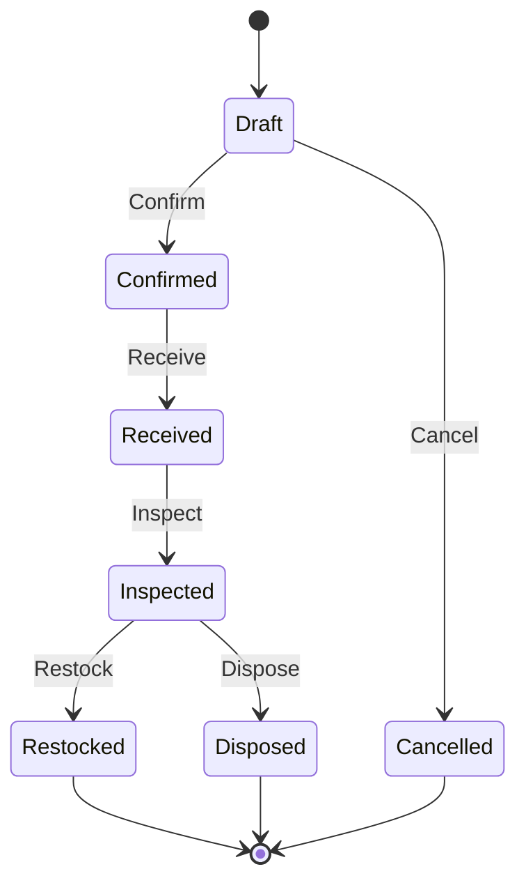
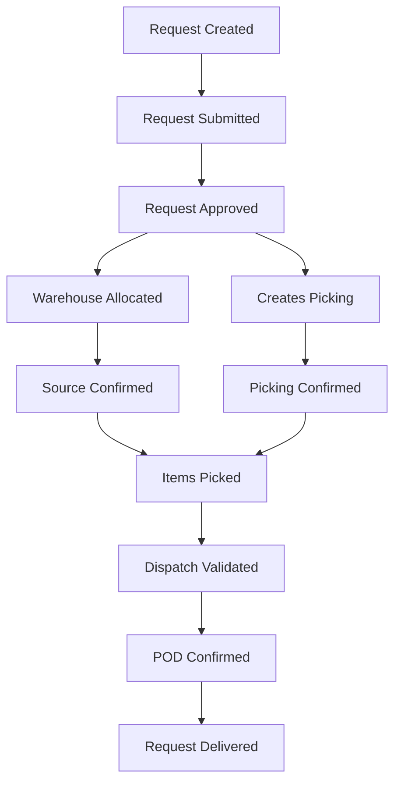
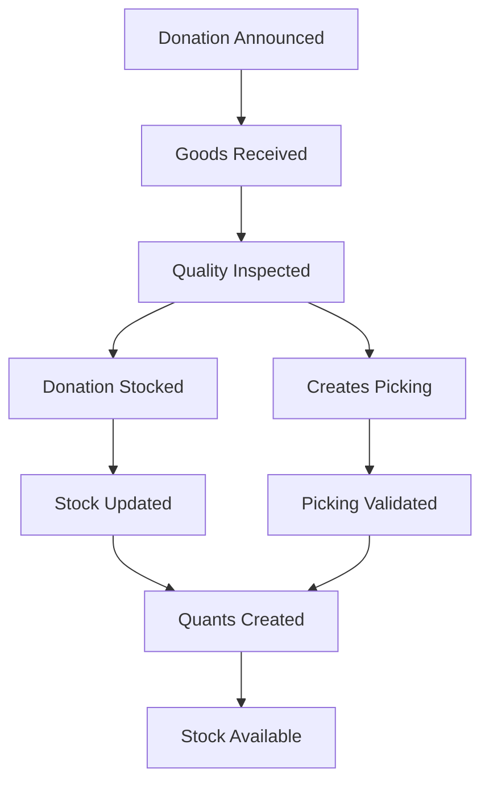

# DRIMS Workflows

This document describes the core workflows in DRIMS for managing disaster relief operations.

## Donation Workflow

Donations flow through a linear state machine from announcement to stocking.

### States

| State       | Description                          | Actions Available     |
| ----------- | ------------------------------------ | --------------------- |
| `announced` | Donation pledged but not yet arrived | Mark Received, Cancel |
| `received`  | Physical goods arrived at warehouse  | Inspect, Cancel       |
| `inspected` | Quality inspection completed         | Stock, Reject         |
| `stocked`   | Items added to warehouse inventory   | (Terminal)            |
| `cancelled` | Donation cancelled before stocking   | (Terminal)            |
| `rejected`  | Items rejected during inspection     | (Terminal)            |

### Process

1. **Create Donation**

   - Select incident and receiving warehouse
   - Enter donor information (linked partner or free text)
   - Add line items with pledged quantities
   - State: `announced`

2. **Receive Donation** (`action_mark_received`)

   - Warehouse staff confirms physical arrival
   - Enter actual received quantities (may differ from pledged)
   - Set received date
   - State: `received`

3. **Inspect Donation** (`action_inspect`)

   - Check item condition and quality
   - Note any damaged or substandard items
   - Record condition codes per line
   - State: `inspected`

4. **Stock Donation** (`action_stock`)
   - Creates stock picking (receipt operation)
   - Validates picking to add items to inventory
   - For lot-tracked items, creates or assigns lot numbers
   - State: `stocked`

### Model

**Model**: `spp.drims.donation`

**Key Fields**:

- `incident_id` - Linked disaster incident
- `warehouse_id` - Receiving warehouse
- `donor_id` / `donor_name` - Donor information
- `source_type_id` - Donor type (UN, NGO, Private, Government)
- `restriction_id` - Usage restrictions
- `line_ids` - Donation line items

---

## Request Workflow

Requests use a two-dimensional state model: approval state and fulfillment state.

### Approval States

| State      | Description                 | Actions Available                 |
| ---------- | --------------------------- | --------------------------------- |
| `draft`    | Being prepared by requester | Submit                            |
| `pending`  | Awaiting approval decision  | Approve, Reject, Request Revision |
| `approved` | Approved for fulfillment    | Allocate, Create Dispatch         |
| `rejected` | Denied with reason          | Reset to Draft (re-submit)        |
| `revision` | Returned for changes        | Edit and Re-submit                |

### Fulfillment States

Once approved, requests track fulfillment progress:

| State        | Description                  |
| ------------ | ---------------------------- |
| `pending`    | Awaiting allocation/dispatch |
| `allocated`  | Source warehouse assigned    |
| `dispatched` | Items shipped from warehouse |
| `in_transit` | En route to destination      |
| `delivered`  | Proof of delivery confirmed  |
| `partial`    | Partially delivered          |

### Process

1. **Create Request**

   - Select incident and destination area
   - Set priority and date needed
   - Add requested items with quantities
   - Enter justification and affected population
   - State: `draft`

2. **Submit for Approval** (`action_submit`)

   - Validates request has line items
   - Triggers approval workflow
   - State: `pending`

3. **Approval Decision**

   - **Approve** (`action_approve`): Ready for fulfillment
   - **Reject** (`action_reject`): Denied with reason
   - **Request Revision** (`action_request_revision`): Return for changes

4. **Allocate** (`action_allocate`)

   - Assign source warehouse
   - Check stock availability
   - State: `allocated`

5. **Create Dispatch**

   - Generate stock picking from warehouse
   - Pick items and create waybill
   - State: `dispatched`

6. **Confirm Delivery**
   - Field staff confirms receipt
   - Record proof of delivery (signature, photos)
   - State: `delivered`

### Priority Levels

| Code       | Priority | Description                          |
| ---------- | -------- | ------------------------------------ |
| `critical` | Critical | Life-threatening, immediate response |
| `high`     | High     | Urgent, within 24 hours              |
| `medium`   | Medium   | Standard, within 48-72 hours         |
| `low`      | Low      | Non-urgent, can wait                 |

**Life-Threatening Flag**: Requests marked as life-threatening bypass normal approval thresholds and are escalated
immediately.

### Model

**Model**: `spp.drims.request`

**Key Fields**:

- `incident_id` - Linked disaster incident
- `destination_area_id` - Target delivery area
- `cluster_id` - OCHA humanitarian cluster
- `priority_id` - Priority level
- `is_life_threatening` - Emergency flag
- `date_needed` - Required delivery date
- `approval_state` - Current approval status
- `state_id` - Fulfillment status
- `line_ids` - Requested items

---

## Dispatch Workflow

Dispatches extend Odoo's stock picking model with DRIMS-specific tracking.

### States

### DRIMS Extensions

| Field                 | Purpose                                                     |
| --------------------- | ----------------------------------------------------------- |
| `drims_type_id`       | Transaction type (Donation Receipt, Request Dispatch, etc.) |
| `drims_request_id`    | Linked request being fulfilled                              |
| `incident_id`         | Disaster incident context                                   |
| `beneficiary_area_id` | Delivery destination area                                   |
| `beneficiary_count`   | Number of beneficiaries served                              |
| `date_departed`       | When shipment left warehouse                                |
| `date_arrived`        | When shipment reached destination                           |

### Proof of Delivery (POD)

| Field                | Purpose                        |
| -------------------- | ------------------------------ |
| `pod_received_by`    | Name of person receiving goods |
| `pod_receiver_title` | Title/position of receiver     |
| `pod_receiver_phone` | Contact number                 |
| `pod_signature`      | Digital signature capture      |
| `pod_confirmed`      | POD verification complete      |
| `pod_notes`          | Delivery notes                 |

### Waybill

Each dispatch generates a printable waybill containing:

- Dispatch reference and date
- Source warehouse details
- Destination and contact info
- Item list with quantities
- Signature blocks

---

## Return Workflow

Returns handle items sent back from distribution points.

### States

| State       | Description                      |
| ----------- | -------------------------------- |
| `draft`     | Return being prepared            |
| `confirmed` | Return authorized                |
| `received`  | Items arrived at warehouse       |
| `inspected` | Condition assessed               |
| `restocked` | Good items returned to inventory |
| `disposed`  | Damaged items disposed           |
| `cancelled` | Return cancelled                 |

### Return Reasons

| Code         | Reason                           |
| ------------ | -------------------------------- |
| `excess`     | More items than needed           |
| `damaged`    | Items damaged in transit/storage |
| `expired`    | Items past expiry date           |
| `wrong_item` | Incorrect items sent             |
| `cancelled`  | Distribution cancelled           |

### Model

**Model**: `spp.drims.return`

**Key Fields**:

- `incident_id` - Source incident
- `source_picking_id` - Original dispatch
- `warehouse_id` - Receiving warehouse
- `reason_id` - Return reason
- `line_ids` - Returned items with conditions

---

## Workflow Integration

### Request → Dispatch Flow

### Donation → Stock Flow

