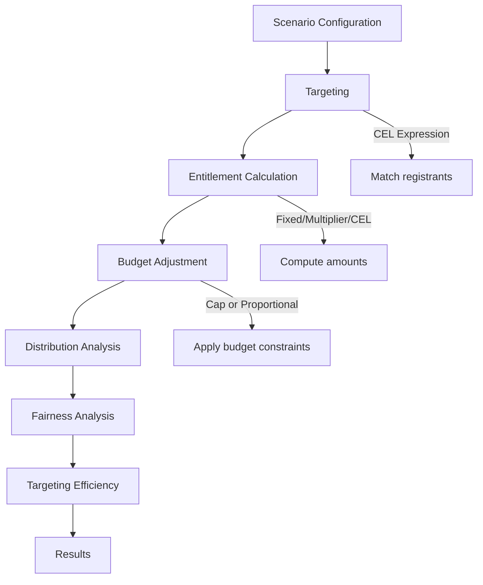
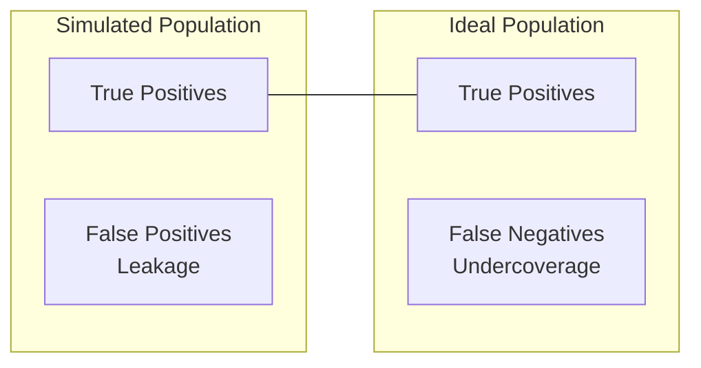
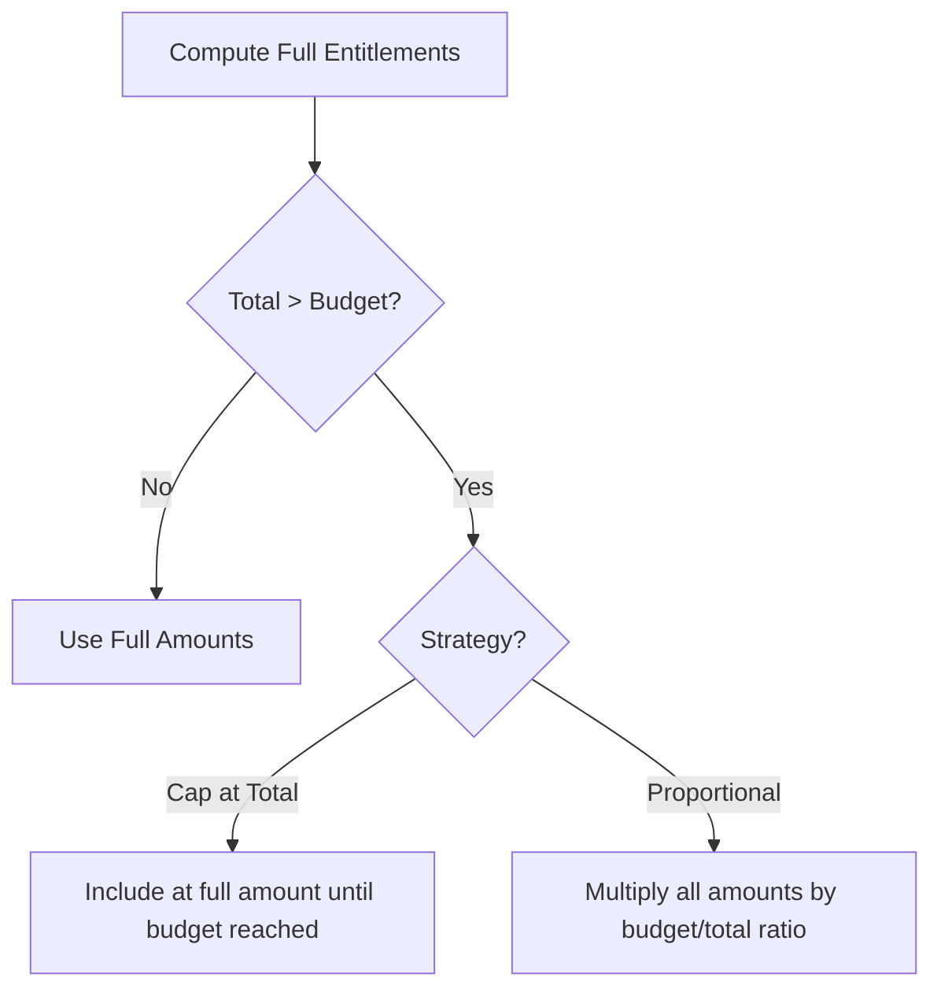

# Simulation Methodology

This document explains the metrics, formulas, and methodology used by the OpenSPP Simulation module.

## Overview

The Simulation module allows you to test targeting scenarios before committing to actual program enrollment. It helps answer questions like:

- How many beneficiaries would this targeting criteria reach?
- What would be the total cost?
- Are benefits distributed equitably across demographic groups?
- How much of my budget would be used?

**When to use simulation:** Before finalizing targeting criteria for a new program cycle, or when considering changes to existing targeting rules.

## Simulation Pipeline



## Metrics Reference

### Coverage Metrics

| Metric | Description | Formula |
|--------|-------------|---------|
| **Beneficiary Count** | Number of registrants who would receive benefits | Count of registrants matching targeting expression |
| **Coverage Rate** | Percentage of registry targeted | `beneficiary_count / total_registry_count × 100` |

### Distribution Metrics

| Metric | Description | Interpretation |
|--------|-------------|----------------|
| **Gini Coefficient** | Measures inequality in benefit distribution | **0** = perfectly equal (everyone gets the same). **1** = maximum inequality. Lower is better. |
| **Standard Deviation** | Spread of benefit amounts around the mean | Higher values indicate more variation in amounts |
| **Mean** | Average benefit amount | `total_cost / beneficiary_count` |
| **Median** | Middle value when amounts are sorted | Less sensitive to outliers than mean |

#### Gini Coefficient Calculation

The Gini coefficient is computed using the standard formula:

```
G = (2 × Σ(i × yᵢ) - (n+1) × Σyᵢ) / (n × Σyᵢ)
```

Where:
- `yᵢ` = benefit amount for person i (sorted ascending)
- `n` = number of beneficiaries
- `i` = rank position (1 to n)

**Interpretation scale:**
- **0.00 - 0.20**: Nearly equal distribution
- **0.20 - 0.40**: Moderate inequality
- **0.40+**: High inequality

### Coverage Parity Metrics

| Metric | Description | Interpretation |
|--------|-------------|----------------|
| **Parity Score** | Aggregate score measuring demographic coverage parity (0-100) | **100** = all groups covered proportionally. Points deducted for under-represented groups. Most meaningful for universal programs. |
| **Coverage Ratio** | Group coverage rate / Overall coverage rate | **1.0** = group matches overall. **< 0.80** = low coverage. **< 0.70** = under-represented |
| **Has Under-representation** | Boolean flag | True if any group has coverage ratio < 0.70 |

### Targeting Efficiency Metrics

These metrics require setting an **Ideal Population Expression** in the scenario configuration.

| Metric | Description | Formula |
|--------|-------------|---------|
| **Leakage Rate** | Recipients who are NOT in the ideal population | `false_positives / total_simulated × 100` |
| **Undercoverage Rate** | Ideal population members who were NOT targeted | `false_negatives / total_ideal × 100` |



**Terminology:**
- **True Positives (TP)**: Correctly targeted (in both simulated and ideal)
- **False Positives (FP)**: Leakage - targeted but shouldn't be (in simulated, not in ideal)
- **False Negatives (FN)**: Undercoverage - should be targeted but weren't (in ideal, not in simulated)

## Fairness Analysis

The fairness analysis evaluates whether targeting criteria inadvertently exclude certain demographic groups by comparing each group's coverage rate to the overall coverage rate.

### How It Works

```
disparity_ratio = group_coverage_rate / overall_coverage_rate
```

**Example:**
- Overall: 1,000 beneficiaries out of 5,000 population = 20% coverage
- Females: 400 out of 2,200 = 18.2% coverage → ratio = 0.91 (fair)
- PWDs: 20 out of 200 = 10% coverage → ratio = 0.50 (disparity)

A ratio of 1.0 means the group is covered at the same rate as the overall population.

### Dimensions Currently Analyzed

The service dynamically detects available demographic fields:

- **Gender** - If `gender_id` field exists with ISO 5218 vocabulary codes
- **Disability** - If `disability_id` field exists (PWD vs non-PWD)

> **Note:** Additional dimensions (age groups, geographic areas, ethnicity) are not currently implemented but could be added by extending `_get_demographic_groups()` in the fairness service.

### Coverage Ratio Thresholds

| Status | Ratio Range | Meaning |
|--------|-------------|---------|
| ✅ **Proportional** | ≥ 0.80 | Group coverage is within 20% of overall |
| ⚠️ **Low coverage** | 0.70 - 0.80 | Group may be under-covered relative to overall |
| ❌ **Under-represented** | < 0.70 | Significant under-representation relative to overall |

> **Important:** For targeted programs (e.g., maternal health, disability support), non-target groups are *expected* to be under-represented. This is by design, not a problem.

### Limitations

- **Limited dimensions**: Only gender and disability are checked (if fields exist)
- **No intersectional analysis**: Disparity ratios computed independently (e.g., doesn't check "disabled women")
- **No statistical significance**: Small groups (N < 30) may show spurious disparity from random variation
- **Over-representation ignored**: Ratio > 1.0 is not flagged (group may be over-represented)
- **No baseline comparison**: Compares to overall coverage, not to population share or external benchmarks

## Budget Strategies

| Strategy | Description | Use When |
|----------|-------------|----------|
| **No Constraint** | Total cost may exceed budget | Exploring potential costs without limits |
| **Cap at Total** | Include beneficiaries at full amount until budget exhausted; remaining get nothing | Benefit amount must remain fixed (e.g., minimum living standard) |
| **Proportional Reduction** | Reduce all amounts proportionally to fit within budget | Reaching all eligible beneficiaries is prioritized over amount per person |



## CEL Expression Examples

CEL (Common Expression Language) is used for targeting and entitlement expressions.

### Basic Targeting

| Goal | Expression |
|------|------------|
| All registrants | `true` |
| Elderly (60+) | `age_years(r.birthdate) >= 60` |
| Children under 5 | `age_years(r.birthdate) < 5` |
| Female-headed households | `is_female(head.gender_id)` |

### Household-based Targeting

| Goal | Expression |
|------|------------|
| Large households (5+ members) | `size(members) >= 5` |
| Households with children under 18 | `has_child_under(members, 18)` |
| Households with elderly members | `any(members, m, age_years(m.birthdate) >= 60)` |

### Geographic Targeting

| Goal | Expression |
|------|------------|
| Rural areas only | `has_area_tag('RURAL')` |
| Specific administrative area | `in_area('DISTRICT_01')` |

### Combining Conditions

| Goal | Expression |
|------|------------|
| Elderly women | `age_years(r.birthdate) >= 60 && is_female(r.gender_id)` |
| Large rural households | `size(members) >= 5 && has_area_tag('RURAL')` |
| Either elderly or disabled | `age_years(r.birthdate) >= 60 \|\| r.disability_level > 0` |

### Ideal Population Examples

The ideal population expression defines who **should** receive benefits (ground truth for measuring targeting accuracy):

| Scenario | Expression |
|----------|------------|
| Below poverty line | `metric('pmt_score') < 2.0` |
| Chronic poverty | `metric('pmt_score') < 1.5 && metric('years_in_poverty') >= 3` |
| Food insecure households | `metric('food_consumption_score') < 28` |

## Technical Notes

- **Standard deviation** uses the population formula (÷n not ÷n-1) for consistency with large-scale data
- **Gini coefficient** uses the trapezoid approximation of the Lorenz curve
- Simulations execute against the **current registry state** (no historical simulation)
- Simulation runs are **preserved for audit compliance** and cannot be deleted
- All computations are performed in-memory using batch processing for scalability
